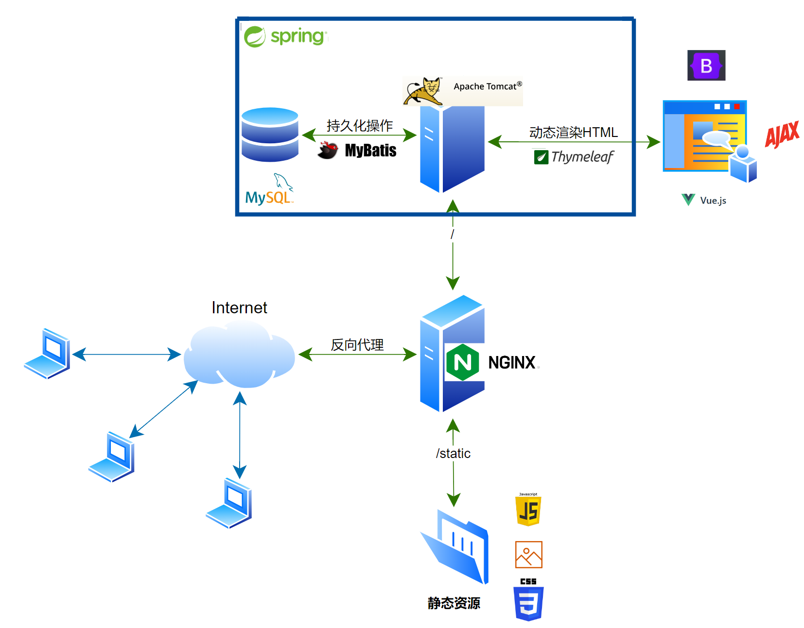
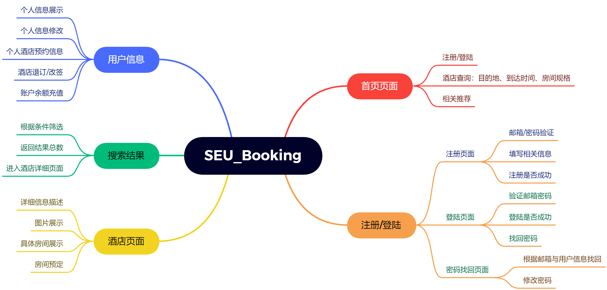

since 2023.04.09

⭐⭐⭐⭐**团队**⭐⭐⭐⭐

- 👨‍💻Shuxin-Wang  📫shuxinwang662@gmail.com
- 👨‍💻Haoyang-Chen 📫haoyang.chen5@icloud.com
- 👨‍💻Jincheng-Li  📫1635461341@qq.com
- 👨‍💻Zesen-Yun    📫yunzesen@163.com

---

# 环境配置

## 软件安装

IDEA➕JDK`17`➕MySQL`8.0.32`➕Tomcat`10.1.7`➕Maven`3.9.1`➕Github Desktop

具体安装和环境配置网上有很多，❗版本最好保持一致❗

先把环境配好再用IDEA打开，不然IDEA内置Maven会自动配置可能会用bug❗

安装完成后用IDEA打开项目⭐

## IDEA配置

❗前提先把上面要求的软件和环境都配置好了❗

### Maven配置

文件👉设置👉构建、执行、部署👉构建工具👉Maven👉把Maven主路径改成自己下载的Maven路径👉**应用**

### Tomcat配置

运行👉编辑配置👉左上角加号选择Tomcat服务器👉本地👉如果没有配置过在选择配置，选择自己下载的Tomcat的文件夹👉部署👉加号选择工件，一般情况有两个，开发阶段选择该项目热部署**后面有war:exploded**的那个👉返回服务器👉可以选择浏览器，**执行更新操作选择<u>更新类和资源</u>，切换出IDEA时选择<u>更新类和资源</u>**，为了分辨配置可以修改上方的名称，也可以不改👉**确定**

## 配置文件

### 数据库配置

❗在路径`src/main/resources`新建数据库配置文件`druid.properties`，❗文件后缀名就是`*.properties`❗

因为每个的数据库用户名和密码不一致，配置如下：

```properties
# 实现驱动不用改
jdbc.driver=com.mysql.cj.jdbc.Driver
# 目标数据库，改成数据集所在数据库名，比如数据集在hotel数据库中
jdbc.url=jdbc:mysql://localhost:3306/hotel
# 用户名，一般是root
jdbc.username=root
# 密码，用自己的密码
jdbc.password=123456
# 下面是数据库连接池相关设置不用改
jdbc.initialSize=10
jdbc.maxActive=40
jdbc.maxWait=10000
```

### 静态资源路径配置

❗在路径`src/main/resources`新建静态资源配置文件`static.properties`❗

```properties
# 静态资源前缀配置
static.prefix=http://[静态资源服务器IP]/static/seu_hotel/
# 搜索页面图片前缀
static.page.image.prefix=image/page/
# 详细页面图片前缀
static.hotels.image.prefix=image/hotels/
# 图片后缀
static.image.suffix=.jpg
```

都完成后运行项目看看是否自动打开浏览器，成功就OK了。


# 项目路径说明

```bash
`--pom.xml（Maven配置文件）
`--README.md
|
|--src
|	|--main（开发文件夹）
|	|	|--java（代码区）
|	|	|	|--booking（组织文件夹）
|	|	|	|	|--entity（实体定义）
|	|	|	|	|	`--Example.java
|	|	|	|	|
|	|	|	|	|--handler（控制层类）
|	|	|	|	|	`--ExampleHandler.java
|	|	|	|	|
|	|	|	|	|--mapper（持久化层接口）
|	|	|	|	|	`--ExampleMapper.java
|	|	|	|	|
|	|	|	|	|--service（逻辑业务层）
|	|	|	|	|	|--api（业务接口）
|	|	|	|	|	|	`--ExampleService.java
|	|	|	|	|	|
|	|	|	|	|	|--impl（业务接口实现类）
|	|	|	|	|	|	`--ExampleServiceImpl.java
|	|	|	|	|
|	|	|	|	|--utils（工具包）
|	|	|	|	|	|--PrefixUtils.java（静态资源前缀工具类）
|	|	|
|	|	|--resources（配置资源文件夹）
|	|	|	`--druid.properties（Druid数据库连接池配置，每个人不一样需要配置）
|	|	|	`--static.properties（静态资源前缀配置，为防止IP泄露，需自己进行配置）
|	|	|	`--logback.xml（日志打印格式配置）
|	|	|	`--mybatis-config.xml（Mybatis全局配置文件）
|	|	|	`--spring-mvc.xml（SpringMVC-IOC配置）
|	|	|	`--spring-persist.xml（Spring持久化层-IOC配置）
|	|	|	|
|	|	|	|--booking.mapper（Mybatis Mapper接口配置）
|	|	|	|	`--ExampleMapper.xml（ExampleMapper接口配置文件）
|	|	|	
|	|	|--webapp（网页视图文件夹）
|	|	|	`--web.xml（Web应用配置文件）
|	|	|	|
|	|	|	|--static（静态资源）
|	|	|	|	|--seu_hotel
|	|	|	|	|	|--script（JS脚本文件）
|	|	|	|	|	|	`--example.js
|	|	|	|	|	|
|	|	|	|	|	|--css（css文件）
|	|	|	|	|	|	`--Example.css
|	|	|	|	|	|
|	|	|	|	|	|--image（图片文件）
|	|	|	|	|	|	`--Example.jpg
|	|	|	|
|	|	|	|--WEB-INF（Web信息）
|	|	|	|	|--templates（Thymeleaf渲染目标，html一般都放在这）
|	|	|	|	|	`--index.html（首页）
|	|	|	|	|	`--example.html
|	|
|	|--test（测试文件夹）
|	|	|--java（代码区）
|	|	|	|--booking（组织文件夹）
|	|	|	|	`--AppTest.java
```


# 技术流程图



- 前端组件：BootStrap5；Ajax；Vue3；Thymeleaf3；
- 后端组件：Spring6；SpringMVC；MyBatis；
- 服务器组件：Nginx；Tomcat；


# 设计建模

## 数据库物理建模

### 地区表

province，city，county

该部分后续可以在前端完成，这里先不确定；

### 酒店信息表info

|  字段名称  |     类型     |   含义   |            备注            |
| :--------: | :----------: | :------: | :------------------------: |
|  hotel_id  |     int      |  酒店ID  |     主键；范围0~10225      |
| hotel_name | varchar(100) | 酒店名称 |                            |
|  dest_id   |     int      | 地区编码 |       县级编码前6位        |
|  address   | varchar(300) | 具体地址 |                            |
|   point    |    double    |   评分   |    Null表示无评价；<=10    |
|    star    |     int      |   星级   |   0表示不知星级；范围0~5   |
| image_num  |     int      | 图片数量 |                            |
| desciption | varchar(800) | 简要描述 |      “null”表示无描述      |
|  can_book  |   tinyint    | 可否预定 | 1表示可预定；0表示不可预定 |

### 酒店描述表desc

|  字段名称   |     类型     |   含义   |        备注        |
| :---------: | :----------: | :------: | :----------------: |
|  hotel_id   |     int      |  酒店ID  | 主键1；范围0~10225 |
|    index    |     int      | 段落索引 |      主键2；       |
| description | varchar(800) | 详细描述 |                    |

### 房间记录表rooms

|  字段名称   |     类型     |   含义   |        备注        |
| :---------: | :----------: | :------: | :----------------: |
|  hotel_id   |     int      |  酒店ID  | 主键1；范围0~10225 |
|    index    |     int      | 房间索引 |       主键2        |
|  room_name  | varchar(200) | 房间名称 |                    |
| description | varchar(300) | 房间描述 |                    |
|  capacity   | varchar(50)  | 房间容量 |                    |
|    price    |   decimal    |   价格   |                    |
|  room_num   |     int      | 房间数量 |     默认都为10     |

### 酒店政策表policies

| 字段名称 |     类型     |   含义   |    备注     |
| :------: | :----------: | :------: | :---------: |
| hotel_id |     int      |  酒店ID  | 范围0~10225 |
| p_title  | varchar(20)  | 政策标题 |             |
|  p_desc  | varchar(300) | 政策描述 |             |

### 用户注册表user

|    字段名称    |    类型     |   含义   |      备注       |
| :------------: | :---------: | :------: | :-------------: |
|    user_id     |     int     |  用户ID  | 主键1；自动递增 |
| account_number | varchar(30) | 登陆账号 |      主键2      |
|     passwd     | varchar(20) | 登陆密码 |                 |
|   user_name    | varchar(20) | 真实姓名 |                 |
|     email      | varchar(30) | 电子邮箱 |                 |
|  phone_number  | varchar(20) | 电话号码 |                 |
|    balance     |   decimal   | 账户余额 |                 |

### 酒店预定表booking

|  字段名称  |   类型   |     含义     |      备注      |
| :--------: | :------: | :----------: | :------------: |
|  book_id   |   int    |    预定ID    | 主键；自动递增 |
|  user_id   |   int    |    用户ID    |                |
|  hotel_id  |   int    |  预定酒店ID  |                |
| room_index |   int    | 预定房间索引 |                |
| book_date  |   date   |   到达日期   |                |
| check_time | datetime |   下单时间   | 时间戳自动填写 |

## 实体类逻辑建模

逆向构建实体类

- info -> `HotelInfo`
- desc -> `Description`
- rooms -> `Room`
- policies -> `Policies`
- user -> `User`
- booking -> `BookingManager`

为了更好的图片资源寻找路径，创建类`ImagePath`进行专门管理；


# 需求分析



- 要使用Cookie🍪保持用户登陆状态；
- 酒店页面的房间预定要在登陆状态下进行，否则跳转到登陆界面，同时登陆成功后返回原界面；

- ...


## 用户模块

### UserMapper接口

| 方法名              | 标签值 | 返回值  | 参数                                 | 说明                                                |
| ------------------- | ------ | ------- | ------------------------------------ | --------------------------------------------------- |
| selectUserById      | select | User    | Integer userId                       | 根据用户ID返回User对象，密码不正确返回null          |
| selectUserByAccount | select | User    | String userAccount<br/>String passwd | 根据账号密码返回User对象，密码不正确返回null        |
| hasUser             | select | Integer | String userAccount                   | 根据账号判断是否存在用户，存在返回1，不存在返回null |
| addUser             | insert | Integer | User user                            | 添加用户条目                                        |
| removeUSer          | delete | Integer | Integer userId                       | 根据用户ID删除用户信息                              |
| modifyUser          | update | Integer | User                                 | 修改用户信息，需要用到动态SQL                       |

### UserService接口

| 方法名        | 调用Mapper          | 事务     | 返回值  | 参数                                 | 说明               |
| ------------- | ------------------- | -------- | ------- | ------------------------------------ | ------------------ |
| getUser       | selectUserById      | 只读     | User    | Integer userId                       | 根据ID查询用户     |
| login         | selectUserByAccount | 只读     | User    | String userAccount<br/>String passwd | 登陆               |
| findUser      | hasUser             | 只读     | Integer | String userAccount                   | 寻找是否存在该用户 |
| signUp        | addUser             | 读前提交 | Integer | User user                            | 注册               |
| deleteAccount | removeUser          | 读前提交 | Integer | Integer userId                       | 删除账户           |
| modifyInfo    | modifyUser          | 读前提交 | Integer | User                                 | 修改账户信息       |


## 酒店模块

### HotelInfoMapper接口

| 方法名              | 标签值 | 返回值             | 参数                                 | 说明                     |
| ------------------- | ------ | ------------------ | ------------------------------------ | ------------------------ |
| selectHotelByParams | select | List\<HotelInfo>   | HotelInfo hotelInfo<br/>Integer page | 根据相关参数查询酒店列表 |
| selectHotelById     | select | HotelInfo          | Integer hotelId                      | 根据酒店ID查询酒店       |
| 其他条件查询代定义  |        |                    |                                      |                          |
| selectDesById       | select | Lsit\<Description> | Integer hotelId                      | 根据酒店ID查询具体描述   |
| selectRoomById      | select | List\<Room>        | Integer hotelId                      | 根据酒店ID查询房间       |
| selectPoliciesById  | select | List\<Policy>      | Integer hotelId                      | 根据酒店ID查询政策       |

### HotelInfoService接口

| 方法名             | 调用Mapper接口     | 事务 | 返回值             | 参数                                | 说明                   |
| ------------------ | ------------------ | ---- | ------------------ | ----------------------------------- | ---------------------- |
| queryHotels        | selectHotelByDest  | 只读 | List\<HotelInfo>   | HotelInfo hotelInfo<br>Integer page | 根据参数查询酒店       |
| getHotel           | selectHotelById    | 只读 | HotelInfo          | Integer hotelId                     | 获取带个酒店实体       |
| 其他条件查询代定义 |                    |      |                    |                                     |                        |
| getDescriptions    | selectDesById      | 只读 | Lsit\<Description> | Integer hotelId                     | 根据酒店ID查询具体描述 |
| getRooms           | selectRoomById     | 只读 | List\<Room>        | Integer hotelId                     | 根据酒店ID查询房间     |
| getPolicies        | selectPoliciesById | 只读 | List\<Policy>      | Integer hotelId                     | 根据酒店ID查询政策     |


## 预定模块

### BookingMapper接口

| 方法名               | 标签值 | 返回值                | 参数                                                  | 说明                                       |
| -------------------- | ------ | --------------------- | ----------------------------------------------------- | ------------------------------------------ |
| selectBookingByUser  | select | List\<BookingManager> | Integer userId                                        | 根据用户ID查询预定记录                     |
| selectBookingByHotel | select | List\<BookingManager> | Integer hotelId<br>Integer roomIndex<br>Date bookDate | 根据酒店ID、房间索引和预定时间查询预定记录 |
| addBooking           | insert | Integer               | BookingManager                                        | 添加预定条目                               |
| removeBooking        | delete | Integer               | Integer bookId                                        | 根据预定ID删除预定条目                     |
| modifyBooking        | update | Integer               | BookingManager                                        | 修改入住时间                               |

### BookingService接口

| 方法名            | 调用Mapper           | 事务     | 返回值                | 参数                                                  | 说明                                       |
| ----------------- | -------------------- | -------- | --------------------- | ----------------------------------------------------- | ------------------------------------------ |
| getUserBooking    | selectBookingByUser  | 只读     | List\<BookingManager> | Integer userId                                        | 根据用户ID查询预定记录                     |
| getHotelBooking   | selectBookingByHotel | 只读     | List\<BookingManager> | Integer hotelId<br>Integer roomIndex<br>Date bookDate | 根据酒店ID、房间索引和预定时间查询预定记录 |
| toBooking         | addBooking           | 读前提交 | Integer               | BookingManager                                        | 添加预定条目                               |
| cancelBooking     | removeBooking        | 读前提交 | Integer               | Integer bookId                                        | 根据预定ID删除预定条目                     |
| changeBookingDate | modifyBooking        | 读前提交 | Integer               | BookingManager                                        | 修改入住时间                               |


# 交互Handdler

